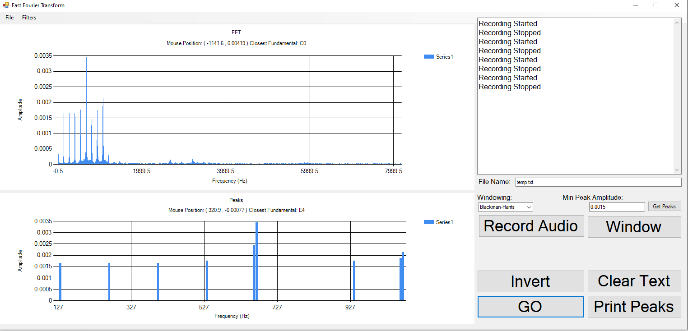

# Fast-Fourier-Transform Program
-This is a program that I made during my senior year of High School. It is able to analyze audio input from the 
time domain to the frequency domain.

-This program also allows for simple strict Low Pass, High Pass, and Range filters to get rid of certain frequencies. After doing so, 
one may reconvert the frequencies back into a .wav file.

-Basic Windowing techniques such as Hanning, Hamming, Circle, and Blackman-Harris.

-You may also save and open files.

</img>
